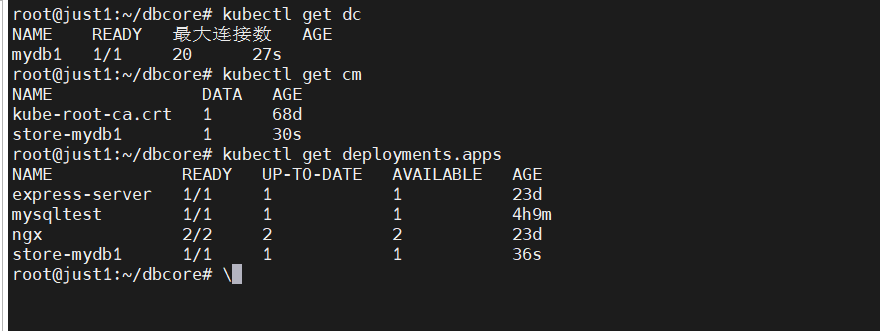

# store-operator

创建项目
```
kubebuilder init --domain setcreed.github.io --repo setcreed.github.io/store
```

创建API
```
kubebuilder create api --group apps --version v1alpha1 --kind DbConfig
```

# 构建 部署

build binary
```bash
make build
```

build image
```bash
make docker-build
```

deploy operator in kubernetes clsuter
```bash
make deploy
```


# 测试

```bash
# store-core 依赖mysql，先部署一个mysql
kubectl apply -f config/samples/mysql_test.yaml

# 创建一个test数据库

# 创建cr
kubectl apply -f config/samples/apps_v1alpha1_dbconfig.yaml
```


# 使用store-core-sdk 操作db
https://github.com/setcreed/store-core-sdk/blob/master/examples/query.go

