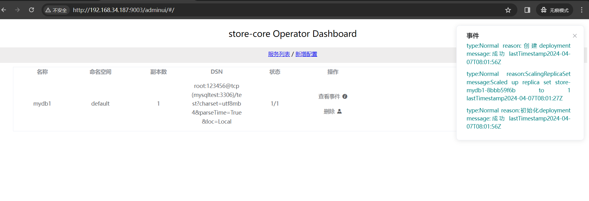

# store-operator

创建项目
```
kubebuilder init --domain setcreed.github.io --repo setcreed.github.io/store
```

创建API
```
kubebuilder create api --group apps --version v1alpha1 --kind DbConfig
```

创建webhook
```
kubebuilder create webhook --group apps --version v1alpha1 --kind DbConfig --programmatic-validation --defaulting
```
通过设置--defaulting可创建mutatingadmissionwebhook类型准入控制器，用来修改传入资源；参数--programmatic-validation可创建validatingadmissionwebhook，用来验证传入资源


# 构建 部署

build binary
```bash
make build
```

build image
```bash
make docker-build
```

deploy operator in kubernetes cluster
```bash
make deploy
```

如果添加webhook，需要先部署cert-manager
```bash
kubectl apply -f https://github.com/cert-manager/cert-manager/releases/download/v1.14.4/cert-manager.yaml
```

# 测试

```bash
# store-core 依赖mysql，先部署一个mysql
kubectl apply -f config/samples/mysql_test.yaml

# 创建一个test数据库

# 创建cr
kubectl apply -f config/samples/apps_v1alpha1_dbconfig.yaml
```


# 使用store-core-sdk 操作db
https://github.com/setcreed/store-core-sdk/blob/master/examples/query.go


# store-operator dashboard
监听在9003端口上
